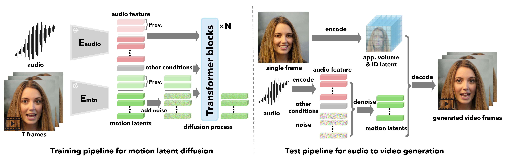

# VASA-1-hack
Using Claude Opus to reverse engineer code from white paper (this is for La Raza)
https://www.youtube.com/watch?v=bZ8AS300WH4





THIS PROJECT IS ACAMEDIC EXCERCISE


The Real3DPortrait code seems to provide warping / volumetric models as a downstream implmentation of One-shot free-view neural talking-head synthesis for video conferencing code. modules cherry picked from 
https://github.com/yerfor/Real3DPortrait/


**MegaPortrait** - side quest 
https://github.com/johndpope/MegaPortrait-hack
fyi - Kevin Fringe attempted to implement the MegaPortraits paper by SamsungLabs / Russia team 
I rebuilt it using Claude + and cherry pick some code from SamsungLabs Rome project. 
I'm hopeful I can get this to boot / train. 
 
UPDATE - it's training / converging 
https://github.com/johndpope/MegaPortrait-hack/issues/36


**EMOPortrait** - SAVE the date - code drops 1st July
this should give us the resnet50 warp code that MegaPortrait's is based on - not keypoints.
The CanonicalKeypointDetector is erroneous - but once EMOPortrait's comes online - should be easy to switch out.

https://github.com/neeek2303/EMOPortraits
https://arxiv.org/pdf/2404.19110


All the models / code created in Net.py from Claude Opus.


```python

class DisentanglementLosses(nn.Module):
    def __init__(self):
        super(DisentanglementLosses, self).__init__()
        self.l1_loss = nn.L1Loss()
        self.cosine_similarity = nn.CosineSimilarity(dim=1)
        self.face_analysis = FaceAnalysis(providers=['CUDAExecutionProvider', 'CPUExecutionProvider'])
        self.face_analysis.prepare(ctx_id=0, det_size=(640, 640))
    
    def extract_identity_features(self, image):
        # Assume image is a tensor of shape (batch_size, 3, height, width)
        image = image.permute(0, 2, 3, 1).cpu().numpy() * 0.5 + 0.5
        image = (image * 255).astype('uint8')
        
        identity_features = []
        for img in image:
            faces = self.face_analysis.get(img)
            if len(faces) > 0:
                identity_features.append(faces[0].embedding)
            else:
                identity_features.append(None)
        
        identity_features = [torch.from_numpy(feat).float().cuda() if feat is not None else None for feat in identity_features]
        return identity_features
    
    def forward(self, img1, img2, img1_recon, img2_recon, img1_pose_transfer, img2_dyn_transfer, img1_cross_id_transfer, img2_cross_id_transfer):
        # Pairwise head pose and facial dynamics transfer loss
        loss_pairwise_transfer = self.l1_loss(img1_pose_transfer, img2_dyn_transfer)
        
        # Face identity similarity loss for cross-identity motion transfer
        id_feat1 = self.extract_identity_features(img1)
        id_feat2 = self.extract_identity_features(img2)
        id_feat1_cross_id_transfer = self.extract_identity_features(img1_cross_id_transfer)
        id_feat2_cross_id_transfer = self.extract_identity_features(img2_cross_id_transfer)
        
        loss_id_sim = torch.tensor(0.0).cuda()
        count = 0
        for feat1, feat2, feat1_cross, feat2_cross in zip(id_feat1, id_feat2, id_feat1_cross_id_transfer, id_feat2_cross_id_transfer):
            if feat1 is not None and feat2 is not None and feat1_cross is not None and feat2_cross is not None:
                loss_id_sim += 1 - self.cosine_similarity(feat1, feat1_cross) + 1 - self.cosine_similarity(feat2, feat2_cross)
                count += 1
        
        if count > 0:
            loss_id_sim /= count
        
        return loss_pairwise_transfer, loss_id_sim
    


class FaceEncoder(nn.Module):
    def __init__(self, use_weight_norm=False):
        super(FaceEncoder, self).__init__()
        self.appearance_extractor = AppearanceFeatureExtractor()
        self.canonical_kp_detector = CanonicalKeypointDetector()
        self.pose_exp_estimator = PoseExpressionEstimator()
        
    def forward(self, x):
        appearance_volume = self.appearance_extractor(x)
        canonical_keypoints = self.canonical_kp_detector(x)
        yaw, pitch, roll, t, delta = self.pose_exp_estimator(x)
        head_pose = torch.cat([yaw.unsqueeze(1), pitch.unsqueeze(1), roll.unsqueeze(1), t], dim=1)
        facial_dynamics = delta
        return appearance_volume, canonical_keypoints, head_pose, facial_dynamics
        


# class FaceDecoder(nn.Module):
#     def __init__(self):
#         super(FaceDecoder, self).__init__()
#         self.generator = Generator()
        
#     def forward(self, appearance_volume, deformation, occlusion):
#         reconstructed_face = self.generator(appearance_volume, deformation, occlusion)
#         return reconstructed_face
    
class FaceDecoder(nn.Module):
    def __init__(self, use_weight_norm=True):
        super(FaceDecoder, self).__init__()
        self.in_conv = ConvBlock2D("CNA", 32 * 16, 256, 3, 1, 1, use_weight_norm, nonlinearity_type="leakyrelu")
        self.res = nn.Sequential(
            ResBlock2D(256, use_weight_norm),
            ResBlock2D(256, use_weight_norm),
            ResBlock2D(256, use_weight_norm),
            ResBlock2D(256, use_weight_norm),
            ResBlock2D(256, use_weight_norm),
            ResBlock2D(256, use_weight_norm)
        )
        self.up = nn.Sequential(
            nn.Upsample(scale_factor=2),
            ConvBlock2D("CNA", 256, 128, 3, 1, 1, use_weight_norm),
            nn.Upsample(scale_factor=2),
            ConvBlock2D("CNA", 128, 64, 3, 1, 1, use_weight_norm),
            nn.Upsample(scale_factor=2),
            ConvBlock2D("CNA", 64, 3, 7, 1, 3, use_weight_norm, activation_type="tanh")
        )
        self.motion_field_estimator = MotionFieldEstimator(model_scale='small')

    def forward(self, appearance_volume, identity_code, head_pose, facial_dynamics):
        N, _, D, H, W = appearance_volume.shape
        x = appearance_volume.view(N, -1, H, W)
        x = self.in_conv(x)
        x = self.res(x)
        
        # Generate motion field using the MotionFieldEstimator
        deformation, occlusion = self.motion_field_estimator(appearance_volume, head_pose, facial_dynamics)
        
        # Apply deformation to the feature volume
        deformed_x = F.grid_sample(x, deformation, align_corners=True, padding_mode='border')
        
        # Apply occlusion-aware decoding
        face_image = self.up(deformed_x * occlusion)
        return face_image

# Define the diffusion transformer for holistic facial dynamics generation
'''
In the provided code snippet for the DiffusionTransformer class, the transformer architecture is implemented using the nn.TransformerEncoderLayer module from PyTorch. The queries, keys, and values are internally computed within each transformer layer based on the input features.

The nn.TransformerEncoderLayer module takes care of computing the queries, keys, and values from the input features using linear transformations. The attention mechanism in the transformer layer then uses these queries, keys, and values to compute the self-attention weights and update the input features.

Here's a breakdown of the transformer architecture in the code:

The DiffusionTransformer class is initialized with the number of layers (num_layers), number of attention heads (num_heads), hidden size (hidden_size), and dropout probability (dropout).
In the __init__ method, the class creates a nn.ModuleList called self.layers, which contains num_layers instances of nn.TransformerEncoderLayer. Each transformer layer has the specified hidden_size, num_heads, and dropout probability.
The forward method takes the input features x, audio_features, gaze_direction, head_distance, and emotion_offset.
The input features are concatenated along the last dimension using torch.cat to form a single tensor input_features.
The concatenated input_features tensor is then passed through each transformer layer in self.layers using a loop. Inside each transformer layer, the following operations are performed:
The input features are linearly transformed to compute the queries, keys, and values.
The attention mechanism computes the self-attention weights using the queries, keys, and values.
The self-attention weights are used to update the input features.
The updated features are passed through a feedforward neural network.
Residual connections and layer normalization are applied.
After passing through all the transformer layers, the output features are normalized using nn.LayerNorm in self.norm(x).
The final output x is returned, which represents the processed features after applying the transformer layers.
The transformer architecture in this code leverages the self-attention mechanism to capture dependencies and relationships among the input features. The queries, keys, and values are internally computed within each transformer layer based on the input features, allowing the model to learn and update the feature representations through the attention mechanism.
'''

class DiffusionTransformer(nn.Module):
    def __init__(self, num_layers, num_heads, hidden_size, dropout=0.1):
        super(DiffusionTransformer, self).__init__()
        self.layers = nn.ModuleList([
            nn.TransformerEncoderLayer(hidden_size, num_heads, hidden_size, dropout)
            for _ in range(num_layers)
        ])
        self.norm = nn.LayerNorm(hidden_size)

    def forward(self, x, audio_features, gaze_direction, head_distance, emotion_offset, guidance_scale=1.0):
        # Concatenate input features
        input_features = torch.cat([x, audio_features, gaze_direction, head_distance, emotion_offset], dim=-1)
        
        # Apply transformer layers
        for layer in self.layers:
            x = layer(input_features)
        
        x = self.norm(x)
        
        # Apply Classifier-Free Guidance
        if guidance_scale != 1.0:
            uncond_input_features = torch.cat([x, audio_features, torch.zeros_like(gaze_direction), 
                                               torch.zeros_like(head_distance), torch.zeros_like(emotion_offset)], dim=-1)
            uncond_output = self.forward(uncond_input_features, audio_features, gaze_direction, head_distance, emotion_offset, guidance_scale=1.0)
            x = uncond_output + guidance_scale * (x - uncond_output)
        
        return x
    

    

# Decoder
'''
we extract the head pose parameters (yaw, pitch, roll, and translation t) and facial dynamics (delta) from the input latent codes z_pose and z_dyn.
We then use the transform_kp function to transform the keypoints based on the head pose and facial dynamics. This function applies the necessary transformations to the canonical 3D volume V_can to obtain the transformed keypoints kp_pose.
Next, we create a 2D coordinate grid using make_coordinate_grid_2d and repeat it for each batch sample. We add the transformed keypoints kp_pose to the grid to obtain the transformed grid coordinates.
Finally, we use F.grid_sample to warp the feature volume x using the transformed grid coordinates. The warped feature volume x_warped is then passed through the upsampling layers to generate the final face image.
Note that you may need to adjust the dimensions and shapes of the tensors based on your specific implementation and the dimensions of V_can and the latent codes.
'''
class Decoder(nn.Module):
    def __init__(self, use_weight_norm=True):
        super(Decoder, self).__init__()
        self.in_conv = ConvBlock2D("CNA", 64, 256, 3, 1, 1, use_weight_norm, nonlinearity_type="leakyrelu")
        self.res = nn.Sequential(
            ResBlock2D(256, use_weight_norm),
            ResBlock2D(256, use_weight_norm),
            ResBlock2D(256, use_weight_norm),
            ResBlock2D(256, use_weight_norm),
            ResBlock2D(256, use_weight_norm),
            ResBlock2D(256, use_weight_norm)
        )
        self.up = nn.Sequential(
            nn.Upsample(scale_factor=2),
            ConvBlock2D("CNA", 256, 128, 3, 1, 1, use_weight_norm),
            nn.Upsample(scale_factor=2),
            ConvBlock2D("CNA", 128, 64, 3, 1, 1, use_weight_norm),
            nn.Upsample(scale_factor=2),
            ConvBlock2D("CNA", 64, 3, 7, 1, 3, use_weight_norm, activation_type="tanh")
        )
        self.fh = FaceHelper()

    def forward(self, V_can, z_id, z_pose, z_dyn):
        N, C, D, H, W = V_can.shape
        x = V_can.view(N, -1, H, W)
        x = self.in_conv(x)
        x = self.res(x)

        # Apply 3D warping based on head pose and facial dynamics
        # yaw, pitch, roll = z_pose[:, 0], z_pose[:, 1], z_pose[:, 2]
        yaw, pitch, roll = self.fh.calculate_pose(z_pose)
        t = z_pose[:, 3:]
        delta = z_dyn

        # Transform keypoints based on head pose and facial dynamics
        kp_pose, R = transform_kp(V_can, yaw, pitch, roll, t, delta)

        # Warp the feature volume using the transformed keypoints
        grid = make_coordinate_grid_2d(x.shape[2:]).unsqueeze(0).repeat(N, 1, 1, 1).to(x.device)
        grid = grid.view(N, -1, 2)
        kp_pose = kp_pose.view(N, -1, 2)
        grid_transformed = grid + kp_pose
        grid_transformed = grid_transformed.view(N, x.shape[2], x.shape[3], 2)
        x_warped = F.grid_sample(x, grid_transformed, align_corners=True)

        face_image = self.up(x_warped)
        return face_image


'''
In this implementation:

The ClassifierFreeGuidance module takes a diffusion model (model) and a list of guidance scales (guidance_scales) as input.
The forward method computes the unconditional model output (unconditional_output) by passing None as the conditioning information.
It then computes the conditional model output (conditional_output) by passing the actual conditioning information (cond).
The Classifier-free Guidance is applied by computing a weighted sum of the difference between the conditional and unconditional outputs, using the provided guidance scales.
The final output is the sum of the weighted difference and the unconditional output.
During training or sampling, you can create an instance of the ClassifierFreeGuidance module with the desired guidance scales and use it like a regular diffusion model. The conditioning information (cond) should be provided based on your specific task (e.g., class labels, text embeddings, or other conditioning signals).

Note that this is a general implementation, and you may need to adjust it based on your specific diffusion model architecture and conditioning requirements.
'''
class ClassifierFreeGuidance(nn.Module):
    def __init__(self, model, guidance_scales):
        super().__init__()
        self.model = model
        self.guidance_scales = guidance_scales

    def forward(self, x, t, cond):
        # Compute the unconditional model output
        unconditional_output = self.model(x, t, None)

        # Compute the conditional model output
        conditional_output = self.model(x, t, cond)

        # Apply Classifier-free Guidance
        guidance_output = torch.zeros_like(unconditional_output)
        for scale in self.guidance_scales:
            guidance_output = guidance_output + scale * (conditional_output - unconditional_output)

        return guidance_output + unconditional_output
# Example usage
# guidance_scales = [1.0, 0.5]  # Adjust the scales as needed
# guided_model = ClassifierFreeGuidance(diffusion_model, guidance_scales)

# # During training or sampling
# x = ...  # Input noise or image
# t = ...  # Timestep
# cond = ...  # Conditioning information (e.g., class labels, text embeddings)
# output = guided_model(x, t, cond)
```


```json
Here's how the provided code aligns with the VASA paper:

1. Face Latent Space Construction:
   - The code defines encoders for extracting various latent variables from face images, similar to the approach mentioned in the VASA paper.
   - The `Canonical3DVolumeEncoder`, `IdentityEncoder`, `HeadPoseEncoder`, and `FacialDynamicsEncoder` classes correspond to the encoders for extracting the canonical 3D appearance volume, identity code, 3D head pose, and facial dynamics code, respectively.
   - The `ExpressiveDisentangledFaceLatentSpace` class combines these encoders and a decoder to form the overall framework for learning the disentangled face latent space.
   - The loss functions used in the `ExpressiveDisentangledFaceLatentSpace` class, such as reconstruction loss, pairwise transfer loss, and identity similarity loss, align with the losses mentioned in the paper for achieving disentanglement and expressiveness.

2. Holistic Facial Dynamics Generation with Diffusion Transformer:
   - The `DiffusionTransformer` class in the code represents the diffusion transformer model used for generating holistic facial dynamics and head motion.
   - The architecture of the `DiffusionTransformer` class, with its transformer layers and input feature concatenation, aligns with the description in the VASA paper.
   - The forward method of the `DiffusionTransformer` class takes in the latent codes, audio features, gaze direction, head distance, and emotion offset as conditioning signals, similar to the approach mentioned in the paper.

3. Talking Face Video Generation:
   - The `Decoder` class in the code corresponds to the decoder mentioned in the VASA paper for generating talking face videos.
   - The decoder takes the canonical 3D appearance volume, identity code, head pose, and facial dynamics latent codes as input and applies 3D warping based on the head pose and facial dynamics to generate the final face image.
   - The warping process in the decoder, using the `transform_kp` function and grid sampling, aligns with the description in the paper for applying the generated motion latent codes to the appearance volume.

Overall, the code follows the high-level architecture and components described in the VASA paper, including the face latent space construction, holistic facial dynamics generation with diffusion transformer, and the decoder for generating talking face videos. The specific implementation details and function names may differ, but the overall structure and flow of the code align with the concepts presented in the paper.
```


**REFERENCES - condition signals**
gaze direction
Accurate 3d face reconstruction with weakly-supervised learning
https://github.com/Microsoft/Deep3DFaceReconstruction

HSEmotion: High-speed emotion recognition library
https://github.com/av-savchenko/face-emotion-recognition/tree/main


Arface - feature extractor
https://github.com/deepinsight/insightface/tree/master/recognition/arcface_torch

