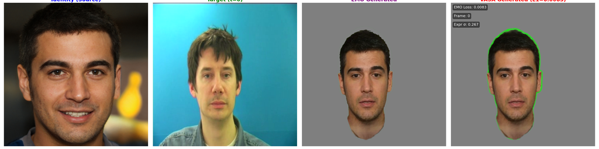
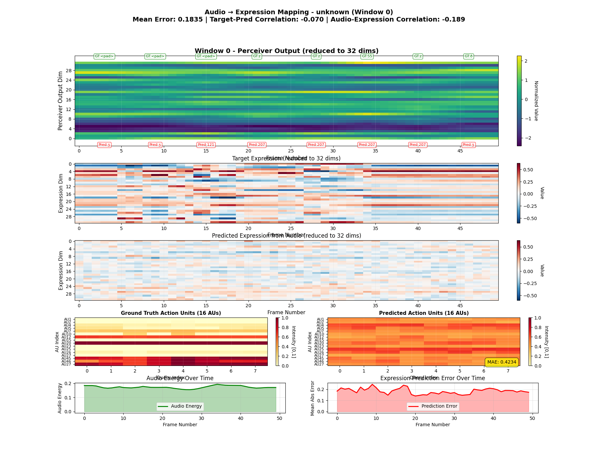

# VASA-1-hack

This repository contains the VASA implementation separated from EMOPortraits, with all components properly configured for standalone training.

## 🎬 Training Progress

**Live Training Dashboard**: [wandb.ai/snoozie/vasa-overfitting](https://wandb.ai/snoozie/vasa-overfitting/runs/8mq2bmob?nw=nwusersnoozie)

### Expression Transfer Visualization



The training visualization shows four panels demonstrating the expression transfer pipeline:

| Panel | Description |
|-------|-------------|
| **Identity (Source)** | The source identity image - the person whose appearance we want to preserve |
| **Target** | The driving video frame - provides the expression/pose we want to transfer |
| **EMO Generated** | Output from the EMOPortraits volumetric avatar model (baseline) |
| **VASA Generated** | Output from our VASA diffusion model - learns to predict motion parameters that drive expression transfer while preserving source identity |

The green outline in the VASA output shows facial landmark detection used for loss computation. The goal is for VASA Generated to match the Target's expression while maintaining the Identity's appearance.

### Audio-to-Expression Mapping



This visualization shows the audio-to-expression correlation during training, demonstrating how the model learns to map audio features to facial expressions for lip-sync.

---

## 🎯 Key Features

- **Clean separation** of VASA motion generation from EMOPortraits volumetric rendering
- **Bridge interface** for easy swapping of volumetric avatar backends
- **XY/UV warping system** for expression transfer and canonical view generation
- **Efficient caching** with single-bucket preprocessing
- **Multi-mode training** support (overfitting, full dataset)


### Setup Instructions

1. **MCP Server Setup (for Claude integration):**
```bash
# Add Weights & Biases MCP server for Claude
claude mcp add wandb -- uvx --from git+https://github.com/wandb/wandb-mcp-server wandb_mcp_server && uvx wandb login
```

2. **Clone the repository with submodules:**
```bash
# Clone with submodules included
git clone --recurse-submodules https://github.com/johndpope/VASA-1-hack.git
cd VASA-1-hack

# Or if you already cloned without submodules:
git submodule update --init --recursive
```


###  Prerequisites

```bash
# Install system dependencies
sudo apt-get update
sudo apt-get install -y ffmpeg git-lfs

mkdir -p ~/miniconda3
wget https://repo.anaconda.com/miniconda/Miniconda3-latest-Linux-x86_64.sh -O ~/miniconda.sh
chmod +x ~/miniconda.sh
~/miniconda.sh
# carefully accept - type yes - 

# Create conda environment
conda create -n vasa python=3.12
conda activate vasa

# Install PyTorch (adjust for your CUDA version)
pip install torch torchvision torchaudio --index-url https://download.pytorch.org/whl/cu129

# Install required packages
pip install omegaconf wandb opencv-python-headless pillow scipy matplotlib tqdm
pip install transformers diffusers accelerate einops
pip install facenet-pytorch insightface hsemotion-onnx
pip install mediapipe OmegaConf wandb
pip install memory-profiler rich
pip install diffusers h5py scikit-learn seaborn python_speech_features
pip install onnxruntime-gpu lpips pytorch_msssim

# EMOPortaits
cd nemo
chmod +x ./bootstrap.sh
./bootstrap.sh

```


3. **Create necessary symlinks:**
```bash
# Create symlink for repos (required for relative paths)
ln -s nemo/repos repos

# Create symlink for data directory (required for aligned keypoints)
ln -s nemo/data data

# Create symlink for losses directory (required for loss model weights)
ln -s nemo/losses losses
```

4. **Download pre-trained volumetric avatar model:**

The pre-trained model should be placed in:
```
nemo/logs/Retrain_with_17_V1_New_rand_MM_SEC_4_drop_02_stm_10_CV_05_1_1/checkpoints/328_model.pth
```

5. **Prepare your training data:**
```bash
# Create directories
mkdir -p junk cache checkpoints

# Place your training videos in the junk directory
# Videos should be .mp4 format
cp your_training_videos/*.mp4 junk/
```

## 📁 Project Structure

```
VASA-1-hack/
├── nemo/                        # Git submodule: nemo repository (base EMOPortraits code)
│   ├── models/                  # Model implementations
│   ├── networks/                # Network architectures
│   ├── losses/                  # Loss functions
│   ├── datasets/                # Dataset loaders
│   ├── repos/                   # External repositories (face_par_off, etc.)
│   └── logs/                    # Pre-trained model checkpoints
│
├── vasa_*.py                    # VASA-specific implementations
│   ├── vasa_trainer.py          # Main training script
│   ├── vasa_model.py            # VASA model architecture
│   ├── vasa_dataset.py          # VASA dataset handler
│   ├── vasa_scheduler.py        # Diffusion scheduler
│   └── vasa_lip_normalizer.py   # Lip normalization utilities
│
├── vasa_config.yaml             # Main configuration file
├── video_tracker.py             # Video tracking utilities
├── syncnet.py                   # Sync network implementation
│
├── data/                        # Data files
│   └── aligned_keypoints_3d.npy
├── losses/                      # Loss model weights
│   └── loss_model_weights/
├── junk/                        # Training videos directory
├── cache/                       # Cache for processed data
├── checkpoints/                 # Model checkpoints
└── repos/                       # Symlink to nemo/repos
```

## ⚙️ Configuration

Edit `vasa_config.yaml` to configure paths and training parameters:

```yaml
paths:
  volumetric_model: "nemo/logs/[...]/328_model.pth"  # Pre-trained model
  volumetric_config: "nemo/models/stage_1/volumetric_avatar/va.yaml"
  data_dir: "data"
  video_folder: "junk"  # Your training videos directory
  cache_dir: "cache"
  checkpoint_dir: "checkpoints"

train:
  batch_size: 1
  num_epochs: 4000
  lr: 1e-3
  # ... other training parameters
```

## 🏃 Running Training

### Test the Setup
```bash
python test_vasa_setup.py
```

Expected output:
```
✓ Config loaded successfully
✓ All paths exist
✓ All modules import correctly
✓ Setup looks good! You can now run vasa_trainer.py
```

### Training Modes

#### 1. **Quick Start - Overfitting Test** (Recommended First)
Test your setup and verify model can train properly:

```bash
# Run overfitting test with optimized settings
python train_overfit.py
```

This uses `overfit_config.yaml` with:
- Single-bucket caching for fast data loading
- Face attribute caching (gaze, emotion, head_distance)
- Optimized batch sizes and learning rates
- WandB integration for monitoring
- Automatic checkpoint resumption

#### 2. **Vanilla Training** (Full Dataset)
Use the standard configuration for training on your complete dataset:

```bash
# Uses vasa_config.yaml by default
python vasa_trainer.py

# Or explicitly specify the config
python vasa_trainer.py --config vasa_config.yaml
```

**Key parameters in `vasa_config.yaml`:**
- `window_size: 50` - Full 50-frame windows
- `n_layers: 8` - Full 8 transformer layers
- `num_steps: 1000` - Full 1000 diffusion steps
- `batch_size: 1` - Adjust based on GPU memory
- `num_epochs: 4000` - Full training schedule

#### 3. **Advanced Overfitting** (With Custom Config)
Use the overfitting configuration via vasa_trainer:

```bash
# Use the overfitting configuration with vasa_trainer
python vasa_trainer.py --config overfit_config.yaml
```

**Key differences in `overfit_config.yaml`:**
- `window_size: 20` - Smaller windows for faster processing
- `n_layers: 2` - Reduced transformer depth (2x-4x faster)
- `num_steps: 100` - Reduced diffusion steps (10x faster)
- `batch_size: 4` - Larger batch for better GPU utilization
- `num_epochs: 100` - Shorter training for quick iteration
- `max_videos: 100` - Limited dataset size
- `num_workers: 8` - Multi-threaded data loading
- No augmentation - Pure overfitting test

**When to use overfitting mode:**
- Testing new model architectures
- Debugging training pipeline
- Verifying data loading and caching
- Quick convergence tests
- Checking if model can overfit to small dataset (sanity check)

### Data Preprocessing (Optional but Recommended)

For faster training, preprocess all windows into a single cache file:

```bash
# Preprocess data for overfitting test (small dataset)
python preprocess_single_bucket.py --max_videos 100 --cache_dir cache_overfit

# Preprocess full dataset
python preprocess_single_bucket.py --max_videos 1000 --cache_dir cache_full
```

Benefits of single-bucket caching:
- **10x faster data loading** - Direct index access to any window
- **Face attributes cached** - Gaze, emotion, head_distance pre-computed
- **Better shuffling** - Perfect for random sampling
- **Memory efficient** - One H5 file instead of many
- **Self-contained windows** - Context is cached, no video dependencies

The cache will be automatically used if:
1. `use_single_bucket: true` in your config file
2. The cache file exists in the specified `cache_dir`

### Monitoring Training

Both training modes support WandB logging:

```bash
# View training progress
# Visit the URL printed at training start, e.g.:
# wandb: 🚀 View run at https://wandb.ai/your-username/vasa/runs/run-id
```

For overfitting mode, runs are grouped as "overfit-experiments" in WandB for easy comparison.

### Custom Dataset Path

To use a different dataset (e.g., CelebV-HQ):

```bash
# Edit the config file or create a custom one
# Update video_folder path in the config:
# video_folder: "/path/to/your/dataset"

# For example, using CelebV-HQ:
# video_folder: "/media/12TB/Downloads/CelebV-HQ/celebvhq/35666"
```

The trainer will:
- Load the pre-trained volumetric avatar model
- Process videos from the configured directory
- Cache processed windows for faster subsequent epochs
- Save checkpoints periodically based on `save_freq`
- Save checkpoints to `checkpoints/` (or `checkpoints_overfit/` for overfitting mode)
- Log to Weights & Biases (if enabled)

### Performance Comparison

| Parameter | Vanilla Training | Overfitting Mode | Speedup |
|-----------|-----------------|------------------|---------|
| Window Size | 50 frames | 20 frames | 2.5x |
| Transformer Layers | 8 | 2 | 4x |
| Diffusion Steps | 1000 | 100 | 10x |
| Batch Size | 1 | 4 | 4x |
| Workers | 0 | 8 | Parallel loading |
| Epoch Time (RTX 5090) | ~5 min | ~1.5 min | 3.3x |

## 🔍 Debugging Tools

### Pipeline Debug Scripts

The project includes several debugging pipelines for analyzing face swap and identity preservation issues:

#### 1. **pipeline3.py** - Advanced Debug Pipeline
```bash
# Test with video (uses joint extraction to prevent identity drift)
python nemo/pipeline3.py --target nemo/data/VID_1.mp4 --max-frames 10

# Test with single image
python nemo/pipeline3.py --target nemo/data/IMG_2.png

# Use custom source identity
python nemo/pipeline3.py --source path/to/source.png --target path/to/target.mp4

# Swap identity mode (use driver's identity with source's expression)
python nemo/pipeline3.py --default-video --swap-identity

# This is useful when the model is extracting the wrong identity
```

Features:
- **Joint extraction**: Processes source+first_driver_frame together to calibrate embeddings
- **Identity swapping**: `--swap-identity` flag to use driver's identity with source's expression
- **Comprehensive tracing**: Every step logged with images and tensors
- **Comparison grids**: Side-by-side visualization of results
- **Warp visualization**: XY/UV warp magnitude heatmaps
- **Debug output**: All intermediates saved to `debug_pipeline3/`

#### 2. **pipeline2.py** - Reference Implementation
```bash
# The reference pipeline that produces correct results
python nemo/pipeline2.py
```

This is the baseline implementation that pipeline3.py was designed to match.

#### 3. **Debug Analysis Scripts**

Various analysis scripts for specific debugging:
- `check_identity_confusion.py` - Analyze identity preservation
- `debug_identity_extraction.py` - Test identity feature extraction
- `test_polished_face_swap.py` - Test face swap quality
- `extract_and_apply_warps_properly.py` - Analyze warp field application

### Understanding XY/UV Warps

The volumetric avatar system uses two types of warps:

1. **XY Warps (Rigid + Non-rigid 3D warping)**
   - Transform from posed face → canonical (neutral) space
   - Removes head pose and expression from source
   - Creates identity-preserving canonical volume

2. **UV Warps (Expression transfer)**
   - Transform from canonical → target expression
   - Applies target's expression and pose
   - Preserves source identity while adopting target motion

### Common Issues and Solutions

#### Identity Drift
**Problem**: Generated face morphs away from source identity
**Cause**: Solo extraction (processing source alone without driver context)
**Solution**: Joint extraction - process source+first_driver_frame together

#### Feminine Appearance on Male Faces
**Problem**: Male faces (e.g., IMG_1.png) appear feminine in results
**Cause**: Identity embeddings not properly calibrated to driver motion space
**Solution**: Joint extraction ensures embeddings are aligned with driver poses

#### Debugging Output Structure
```
debug_pipeline3/
├── trace_YYYYMMDD_HHMMSS.json    # Complete execution trace
├── step_NNNN_*.png                # Intermediate images at each step
├── step_NNNN_*.pt                 # Tensor checkpoints
├── frame_NNN_result.png           # Final output frames
└── video_comparison.png           # Grid comparison of all frames
```

### Trace Analysis

The trace files contain detailed information about each processing step:
- Entry/exit points for all major functions
- Tensor shapes and statistics
- Mask generation and compositing steps
- Warp field generation and application

Use the trace to identify where identity drift or other issues occur in the pipeline.
| Convergence | 1000+ epochs | 10-20 epochs | 50x+ |

## 🔄 Warping System: XY vs UV Warps

The VASA model uses a sophisticated two-stage warping system to separate identity from expression, enabling clean expression transfer between faces.

### Understanding XY and UV Warps

#### XY Warps (Source/Canonical Space)
- **Coordinate System**: XY refers to spatial coordinates (X=width, Y=height) in the 3D volume space (16×64×64 grid)
- **Direction**: FROM current expression → TO canonical (neutral)
- **Purpose**: Expression normalization - removes the current expression to get back to a neutral state
- **Effect**: "Undoes" expressions (e.g., moves smiling mouth corners back to neutral positions)
- **Applied to**: The source volume before any target expression is added

#### UV Warps (Target/Texture Space)
- **Coordinate System**: UV uses texture/surface coordinates (0-1 normalized range)
- **Direction**: FROM canonical → TO target expression
- **Purpose**: Expression application - adds the desired expression to the neutral volume
- **Effect**: Deforms canonical volume to create new expressions (smile, frown, surprise, etc.)
- **Applied to**: The volume after XY warping (canonical state)

### The Two-Stage Pipeline

```
Source Face (😊) → [XY Warp] → Canonical (😐) → [UV Warp] → Target Face (😮)
```

1. **Stage 1 (XY Warping)**: Normalizes any expression to canonical
2. **Stage 2 (UV Warping)**: Applies target expression to canonical

This separation enables:
- **Clean expression transfer** between any source and target
- **Identity preservation** while changing expressions
- **Consistent canonical representation** for all faces

### Warp Extraction in Training

The warps are extracted during dataset preprocessing:

```python
# In vasa_dataset.py - extract warps for training
motion_data = {
    'xy_warps': xy_warps,      # [T, 16, 64, 64, 3] - normalizes to canonical
    'rigid_warps': rigid_warps,  # [T, 16, 64, 64, 3] - head pose alignment
    'uv_warps': uv_warps,       # [T, 16, 64, 64, 3] - applies target expression
    'source_theta': thetas      # [T, 3, 4] - pose matrices
}
```

## 🌉 Bridge Interface Architecture

To cleanly separate VASA from the volumetric avatar implementation, we've developed a bridge interface that abstracts all EMOPortraits-specific details.

### Core Components

#### 1. VolumetricAvatarBridgeInterface (`vasa_emo_bridge_interface.py`)

Abstract interface that any volumetric avatar backend must implement:

```python
class VolumetricAvatarBridgeInterface:
    def extract_warps_for_window(frames, identity_frame_idx) -> WindowWarpData
    def extract_warps_for_frame(identity_frame, target_frame) -> FrameWarpData
    def generate_canonical_view(identity_frame) -> canonical_image
    def get_identity_embedding(identity_frame) -> identity_embed
```

#### 2. EMOPortraitsBridge

Concrete implementation for EMOPortraits/MegaPortraits models:
- Handles all model-specific details internally
- Provides clean warp extraction API
- Manages caching for efficiency
- Supports batch processing for entire windows

### Usage Example

```python
from vasa_emo_bridge_interface import create_bridge

# Create bridge (abstracts all EMO details)
bridge = create_bridge("emoportraits", emo_model)

# Extract warps for entire window at once
window_warps = bridge.extract_warps_for_window(
    frames=frames,           # [T, C, H, W]
    identity_frame_idx=0     # Use first frame as identity
)

# Access extracted warps
xy_warps = window_warps.xy_warps        # [T, D, H, W, 3]
rigid_warps = window_warps.rigid_warps  # [T, D, H, W, 3]
uv_warps = window_warps.uv_warps        # [T, D, H, W, 3]

# Generate canonical view
canonical = bridge.generate_canonical_view(identity_frame)
```

### Benefits of the Bridge Pattern

1. **Clean Separation**: VASA code doesn't need to know EMOPortraits internals
2. **Easy Swapping**: Can replace volumetric backend without changing VASA
3. **Batch Efficiency**: Process entire windows at once
4. **Automatic Caching**: Identity embeddings cached automatically
5. **Type Safety**: Clear data structures with type hints

## 🎭 Canonical View Generation

The system can generate canonical (neutral, front-facing) views from any input expression:

### What is a Canonical View?

A canonical view represents a person in a standardized state:
- **Neutral expression** (no smile, closed mouth)
- **Front-facing pose** (no head rotation)
- **Consistent lighting** and appearance

### How It Works

1. **Extract identity embedding** from the source frame
2. **Create canonical pose** (identity matrix = no rotation)
3. **Process through volumetric model** to get canonical volume
4. **Decode with minimal warping** to get neutral view

### Applications

- **Reference frame generation** for consistent motion synthesis
- **Expression normalization** for training
- **Identity preservation** during expression transfer
- **Quality evaluation** of the volumetric model

### Example Results

When given different expressions as input, the canonical generation produces nearly identical neutral views:
- Average difference between canonical views: < 0.1 (excellent consistency)
- Identity fully preserved
- All expressions normalized to neutral

## 📝 Logging Configuration

### Logging Levels (nemo/logger.py)

The project uses Python's logging module with three configurable levels defined in `nemo/logger.py:28-30`:

```python
# log_level = logging.WARNING    # Minimal output - only warnings and errors
log_level = logging.INFO         # Standard output - informational messages (default)
# log_level = logging.DEBUG       # Verbose output - detailed debugging information
```

**Logging Levels Explained:**

1. **WARNING** (`logging.WARNING`)
   - Shows only warnings, errors, and critical messages
   - Use when you want minimal console output during training
   - Best for production runs where you only need to know about issues

2. **INFO** (`logging.INFO`) - **Currently Active**
   - Shows informational messages, warnings, and errors
   - Provides training progress, epoch updates, and key metrics
   - Default and recommended level for normal training runs
   - Balances visibility with readability

3. **DEBUG** (`logging.DEBUG`)
   - Shows all messages including detailed debugging information
   - Includes tensor shapes, gradient information, and internal state
   - Use when troubleshooting model issues or understanding data flow
   - Can be verbose - recommended only for debugging sessions

**To change the logging level:**
1. Edit `nemo/logger.py` line 29
2. Uncomment the desired level and comment out the others
3. The change takes effect on next run

**Additional Features:**
- Logs are saved to `project.log` file for later review
- Rich formatting with color-coded output and timestamps
- Third-party library logging is suppressed to reduce noise
- TorchDebugger class available for advanced PyTorch debugging

## 🔧 Troubleshooting

### Common Issues and Solutions

1. **ModuleNotFoundError: No module named 'logger'**
   ```bash
   # The logger module is in nemo, paths are already configured
   # If still having issues, check that nemo is cloned properly
   ```

2. **FileNotFoundError: './repos/face_par_off/res/cp/79999_iter.pth'**
   ```bash
   # Ensure the symlink exists:
   ln -s nemo/repos repos
   ```

3. **ValueError: num_samples should be a positive integer value, but got num_samples=0**
   ```bash
   # No videos found. Add videos to junk/ directory:
   cp your_video.mp4 junk/
   ```

4. **FileNotFoundError: Config file not found at channel_config.yaml**
   ```bash
   # Copy from EMOPortraits or create a basic one
   ```

5. **CUDA out of memory**
   - Reduce `batch_size` in vasa_config.yaml
   - Enable gradient checkpointing
   - Reduce `sequence_length` in dataset config

6. **FFmpeg warnings**
   - These can be safely ignored if not processing audio
   - To fix: `pip install ffmpeg-python`

### Required Files from EMOPortraits

If you're missing files, you'll need these from EMOPortraits:
- `channel_config.yaml` - Channel configuration
- `syncnet.py` - Sync network implementation  
- `data/aligned_keypoints_3d.npy` - 3D keypoint alignments
- `losses/loss_model_weights/*.pth` - Pre-trained loss models
- Pre-trained volumetric avatar checkpoint

## 📊 Monitoring Training

Training progress is logged to:
- **Console**: Real-time training metrics
- **Weights & Biases**: Detailed metrics and visualizations (if enabled)
- **Checkpoints**: Saved every N epochs to `checkpoints/`

Monitor training:
```bash
# Watch training logs
tail -f project.log

# Check W&B dashboard
# https://wandb.ai/YOUR_USERNAME/vasa/
```

## 🛠️ Development

### Project Organization

- **VASA-specific code**: Root directory (`vasa_*.py`)
- **Base EMOPortraits code**: `nemo/` directory
- **Configuration**: `vasa_config.yaml`
- **Training data**: `junk/` directory
- **Model outputs**: `checkpoints/` directory

### Key Improvements Made

1. **Separated VASA components** from EMOPortraits codebase
2. **Fixed all hardcoded paths** to be relative or configurable
3. **Proper module imports** with sys.path management
4. **Configurable paths** via vasa_config.yaml
5. **Auto-detection** of project directories in nemo code
6. **Clean separation** between VASA-specific and base code

### Working with the Submodule

**Update nemo to latest version:**
```bash
cd nemo
git pull origin main
cd ..
git add nemo
git commit -m "Update nemo submodule to latest"
```

**Lock to specific nemo version:**
```bash
cd nemo
git checkout <commit-hash>
cd ..
git add nemo
git commit -m "Lock nemo to specific version"
```


## 📝 Notes

- The volumetric model must be pre-trained (from EMOPortraits)
- Training requires at least one video in the `junk/` directory
- All paths in configs are relative to the project root
- The `repos` symlink is required for backward compatibility

## 🚨 Known Issues

- Training requires significant GPU memory (recommended: 24GB+)
- Some imports show FFmpeg warnings (can be ignored)
- Initial dataset processing can be slow (cached afterward)

## 📄 License

This project is licensed under the MIT License - see the [LICENSE](LICENSE) file for details.

Note: The nemo submodule and other dependencies may have their own licenses.

## 🙏 Acknowledgments

- EMOPortraits team for the base implementation
- VASA paper authors for the architecture design
- Contributors to the nemo repository 
