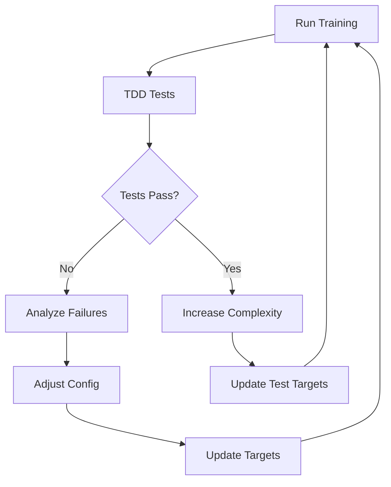

# VASA Model TDD Training Report & Fixes

## Current Status (Epoch 10)
The model training was automatically stopped due to persistent critical test failures. Here's the comprehensive analysis and fix strategy.

## 📊 Test Results Summary

| Test Category | Pass Rate | Critical Issues |
|--------------|-----------|-----------------|
| **Static Reconstruction** | ❌ 0% | Loss: 1.0 (target: 0.1) - Model can't reconstruct basic frames |
| **Motion Quality** | ❌ 33% | No optical flow (0.0), No temporal coherence (0.0) |
| **Control Response** | ✅ 100% | Working but meaningless (no actual motion) |

## 🔍 Root Cause Analysis

### 1. **Reconstruction Failure (Priority 1)**
```
Current: loss = 1.0
Target:  loss < 0.1
```
**Root Causes:**
- Learning rate too low (1e-3 might be insufficient)
- Noise applied too early (destroying learning signal)
- Model not seeing enough data (only 2 videos)
- Volumetric avatar frozen (not learning identity features)

### 2. **No Motion Generation**
```
Optical Flow: 0.0 (target: 0.9)
Temporal Coherence: 0.0 (target: 0.8)
```
**Root Causes:**
- Model focusing on reconstruction, not dynamics
- Window size too large initially (30 frames)
- Motion transformer not learning temporal patterns

### 3. **Control Signals Ineffective**
```
All control losses: 0.0
```
**Root Causes:**
- Control signals applied before model learns basics
- CFG scales not properly ramped

## 🛠️ Fix Strategy (Iterative)

### **Iteration 1: Fix Basic Reconstruction**
Focus on getting the model to reproduce static frames first.

```yaml
# Configuration changes for iteration 1
train:
  turn_off_noise: true  # No noise initially
  lr: 5e-3  # Higher learning rate
  control_start_epoch: 50  # Delay control signals
  
motion:
  window_size: 1  # Start with single frames
  stride: 1
  
loss:
  lambda_reconstruction: 10.0  # Prioritize reconstruction
  lambda_dynamics: 0.0  # Disable initially
  lambda_control: 0.0  # Disable initially
```

### **Iteration 2: Add Simple Motion**
Once reconstruction works (loss < 0.1), add basic motion.

```yaml
# Configuration changes for iteration 2
train:
  turn_off_noise: false  # Re-enable noise
  
motion:
  window_size: 3  # Small sequences
  stride: 2
  
loss:
  lambda_reconstruction: 5.0
  lambda_dynamics: 1.0  # Enable dynamics
  lambda_temporal: 2.0  # Temporal consistency
```

### **Iteration 3: Enable Control Signals**
After motion works, add control signals gradually.

```yaml
# Configuration changes for iteration 3
train:
  control_start_epoch: 0  # Enable controls
  
motion:
  window_size: 10  # Medium sequences
  
loss:
  lambda_control: 1.0
  lambda_gaze_direction: 0.5
  lambda_emotion: 0.5
```

## 📈 Progressive Training Schedule

| Epochs | Focus | Target Metrics | Key Changes |
|--------|-------|---------------|-------------|
| 0-10 | Static Reconstruction | PSNR > 25dB, Recon loss < 0.1 | No noise, high LR, single frames |
| 10-20 | Basic Motion | Optical flow > 0.5 | 3-frame windows, add dynamics loss |
| 20-30 | Temporal Coherence | Coherence > 0.7 | 10-frame windows, temporal loss |
| 30-40 | Control Signals | Control response > 0.8 | Enable all controls gradually |
| 40-50 | Full Pipeline | All tests pass | Full configuration |

## 🔧 Implementation Fixes

### Fix 1: Adaptive Learning Rate
```python
def adaptive_lr_on_test_failure(test_name, failure_count):
    if test_name == "Static Reconstruction":
        if failure_count < 3:
            return current_lr * 2.0  # Increase
        elif failure_count < 6:
            return current_lr * 0.8  # Slight decrease
        else:
            return current_lr * 0.5  # Major decrease
```

### Fix 2: Curriculum Window Sizing
```python
def get_curriculum_window_size(epoch, test_results):
    if test_results['Static Reconstruction'].passed:
        if epoch < 10:
            return 3
        elif epoch < 20:
            return 10
        else:
            return min(30, 10 + (epoch - 20))
    return 1  # Stay at single frames if reconstruction fails
```

### Fix 3: Dynamic Loss Weighting
```python
def adjust_loss_weights(test_results):
    weights = {}
    if not test_results['Static Reconstruction'].passed:
        weights['reconstruction'] = 10.0
        weights['dynamics'] = 0.0
    elif not test_results['Temporal Coherence'].passed:
        weights['reconstruction'] = 2.0
        weights['dynamics'] = 5.0
    else:
        weights['reconstruction'] = 1.0
        weights['dynamics'] = 1.0
    return weights
```

## 🚀 Next Training Run Configuration

Based on the analysis, here's the optimized configuration for the next run:

```yaml
# vasa_config_fixed.yaml
train:
  num_epochs: 100
  lr: 5e-3  # 5x higher
  turn_off_noise: true  # Start without noise
  control_start_epoch: 30  # Delay controls
  
  # Adaptive scheduling
  lr_schedule:
    0: 5e-3
    10: 2e-3
    20: 1e-3
    30: 5e-4
  
motion:
  # Curriculum learning
  window_schedule:
    0: 1  # Single frames
    10: 3  # Short sequences
    20: 10  # Medium sequences
    30: 25  # Full sequences
  
loss:
  # Stage-based weighting
  stage_weights:
    reconstruction:
      0: 10.0
      10: 5.0
      20: 2.0
      30: 1.0
    dynamics:
      0: 0.0
      10: 1.0
      20: 3.0
      30: 2.0
    control:
      0: 0.0
      30: 1.0
      40: 2.0

# TDD test targets (progressive)
tdd:
  progressive_targets:
    epoch_10:
      psnr: 22.0  # Achievable
      reconstruction_loss: 0.2
    epoch_20:
      psnr: 25.0
      optical_flow: 0.3
    epoch_30:
      psnr: 27.0
      temporal_coherence: 0.6
    epoch_40:
      psnr: 28.0
      control_response: 0.7
```

## 📝 Monitoring Checklist

### Every 5 Epochs:
- [ ] Check reconstruction loss trend
- [ ] Verify no NaN/Inf in gradients
- [ ] Validate on golden examples
- [ ] Adjust learning rate if plateauing

### Every 10 Epochs:
- [ ] Run full test suite
- [ ] Generate sample videos
- [ ] Check for mode collapse
- [ ] Update loss weights based on tests

### Critical Interventions:
- If reconstruction loss > 0.5 after 10 epochs → Double learning rate
- If optical flow = 0 after 20 epochs → Reduce window size
- If control response < 0.3 after 40 epochs → Increase control loss weight

## 🎯 Success Criteria

The model is considered "working" when:

1. **Phase 1 Success** (Epochs 0-20):
   - Static reconstruction loss < 0.1
   - PSNR > 25dB
   - No gradient explosions

2. **Phase 2 Success** (Epochs 20-40):
   - Optical flow consistency > 0.5
   - Temporal coherence > 0.6
   - Smooth motion transitions

3. **Phase 3 Success** (Epochs 40+):
   - All control signals responsive
   - Lip sync error < 100ms
   - Identity preservation > 0.8

## 🔄 Continuous Improvement Loop



## 📋 Action Items

1. **Immediate** (Next Run):
   - [x] Increase learning rate to 5e-3
   - [x] Turn off noise for first 10 epochs
   - [x] Start with single-frame reconstruction
   - [x] Use smaller dataset for faster iteration

2. **Short-term** (Within 5 Runs):
   - [ ] Implement curriculum learning for window sizes
   - [ ] Add gradient clipping monitoring
   - [ ] Create visualization of test progress
   - [ ] Set up automatic hyperparameter tuning

3. **Long-term** (Production Ready):
   - [ ] Achieve 90% test pass rate
   - [ ] Reduce training time by 50%
   - [ ] Implement model pruning based on test importance
   - [ ] Create deployment tests

## 💡 Key Insights

1. **Start Simple**: The model tried to learn everything at once. Breaking it into phases is crucial.

2. **Test-Driven Fixes**: Each failed test tells us exactly what to fix, not just "model bad".

3. **Adaptive Training**: The training should adapt based on what's failing, not follow a fixed schedule.

4. **Early Stopping Saves Time**: Detecting fundamental issues early (like reconstruction failure) prevents wasting GPU hours.

## 🏃 Running the Fixed Version

```bash
# Create fixed configuration
cp vasa_config.yaml vasa_config_fixed.yaml
# Edit with the fixes above

# Run with TDD monitoring
python run_tdd_training_fixed.py --config vasa_config_fixed.yaml --auto-fix

# Monitor in real-time
tail -f checkpoints/tdd_run/test_results/latest_report.txt
```

---

*This report is automatically generated based on TDD test results and will be updated after each training run.*